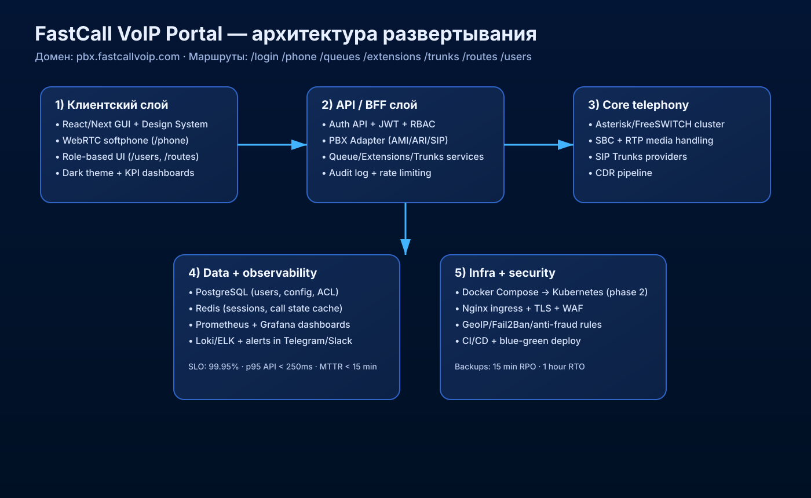
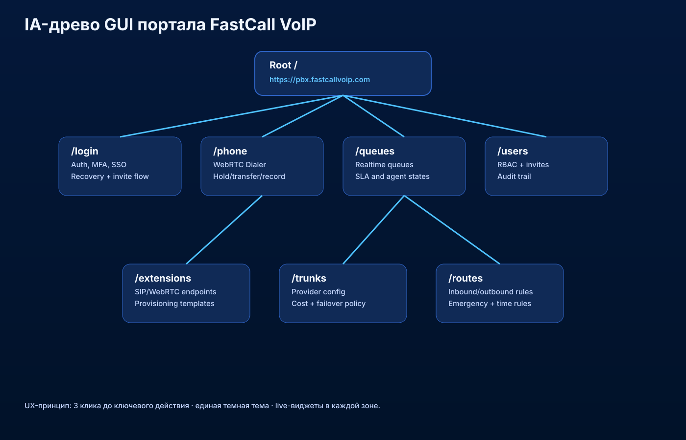

# FastCall VoIP Portal — план запуска с нуля (GUI + WebTelephony)

## 1) Продуктовая цель
Собрать современный веб-портал `pbx.fastcallvoip.com`, где в едином GUI находятся:
- WebPhone (`/phone`)
- Управление очередями (`/queues`)
- Управление внутренними номерами (`/extensions`)
- Управление транками (`/trunks`)
- Управление маршрутизацией (`/routes`)
- Управление пользователями (`/users`)
- Безопасный вход (`/login`)

---

## 2) Визуальная концепция (по вашим референсам)
**Дизайн-направление:**
- Dark enterprise UI (глубокий синий фон, неон-акценты).
- Большие KPI-карточки и графики real-time.
- Радиус 12–18px, мягкие тени, минималистичные иконки.
- Цвета ролей/статусов: `online/active` — зеленый, `warning` — янтарный, `danger` — красный.

**Что это дает бизнесу:**
- Быстрое восприятие состояния PBX (для NOC/суппорта).
- Низкая когнитивная нагрузка операторов.
- Единый визуальный язык для admin/manager/agent.

---

## 3) IA-структура и древо портала

### Сценарии по маршрутам
- `/login`: email/username + MFA + recovery + SSO (опционально).
- `/phone`: web dialer, call controls, history, devices, QoS-индикатор.
- `/queues`: live очередь, SLA, состояние агентов, wallboard.
- `/extensions`: создание/изменение SIP/WebRTC extension, пароли, ACL.
- `/trunks`: провайдеры, failover, лимиты, стоимость/направления.
- `/routes`: входящие/исходящие, приоритеты, emergency dialplan, time rules.
- `/users`: RBAC, приглашения, команды, логи действий.

---

## 4) Архитектура внедрения (с нуля)

### Слой Frontend
- Next.js/React + TypeScript.
- Design system (tokens + компоненты + темы).
- SSE/WebSocket для real-time телеметрии.

### Слой API / BFF
- Auth service (JWT/refresh), RBAC/ABAC.
- PBX Adapter: Asterisk ARI/AMI, SIP provisioning.
- Endpoint API:
  - `GET/POST /api/extensions`
  - `GET/POST /api/queues`
  - `GET/POST /api/trunks`
  - `GET/POST /api/routes`

### Telephony core
- Asterisk/FreeSWITCH (1 active + 1 standby).
- SBC для защиты SIP и media-якорения.
- RTP/WebRTC с STUN/TURN для NAT.

### Data/Monitoring
- PostgreSQL, Redis.
- Prometheus + Grafana + Loki.
- Alerting: Telegram/Slack + on-call runbook.

---

## 5) Пошаговый roadmap запуска

### Фаза 0 (Неделя 1): Foundation
- Домен, DNS, wildcard TLS, reverse proxy.
- CI/CD, `.env` policy, секреты (Vault/SOPS).
- Базовые окружения `dev/stage/prod`.

### Фаза 1 (Недели 2–3): Core auth + shell UI
- `/login`, RBAC, layout, навигация, дизайн-токены.
- Подключение к PBX adapter (read-only).

### Фаза 2 (Недели 4–5): Telephony operations
- `/phone`, `/extensions`, `/trunks`.
- CRUD + аудит + dry-run перед apply.

### Фаза 3 (Недели 6–7): Routing + queues
- `/routes`, `/queues`.
- SLA, интерактивные графики, нотификации.

### Фаза 4 (Неделя 8): Hardening + launch
- Тесты нагрузки, антифрод, security scan.
- Blue/green релиз и go-live checklist.

---

## 6) Сравнение с рынком (2026)

### Что делает рынок сейчас
- **3CX / RingCentral / Aircall / Zoom Phone:**
  - Сильный UX, AI-summary звонков, глубокая аналитика.
  - Интеграции CRM-first (HubSpot, Salesforce).
- **Open-source стек (Asterisk/FreeSWITCH + кастом GUI):**
  - Гибкость и контроль, ниже TCO.
  - Часто слабее по UX и продуктовой упаковке.

### Как выиграть в вашей нише
1. **Speed of Ops**: 1 экран = 1 задача (без “лабиринта” настроек).
2. **Realtime-first**: все критичные сущности показывают живой статус.
3. **Anti-fraud by default**: лимиты, аномалии, блокировки направлений.
4. **PBX + продуктовая аналитика**: не только CDR, но и воронка дозвона.
5. **Шаблоны onboarding**: запуск нового клиента за 15–30 минут.

---

## 7) Нефункциональные стандарты
- Uptime: 99.95%.
- p95 API: до 250ms.
- RPO: 15 минут, RTO: 1 час.
- Security baseline: MFA, audit log, IP policy, WAF.
- Accessibility: контраст AA, клавиатурная навигация.

---

## 8) Готовый план презентации для инвестора/команды (10 слайдов)
1. Проблема рынка VoIP ops.
2. Решение FastCall GUI Portal.
3. UX-референсы и дизайн-система.
4. IA-древо и карта маршрутов.
5. Архитектура backend + telephony.
6. Security/Compliance/Fraud control.
7. Roadmap на 8 недель.
8. Сравнение с текущими игроками.
9. KPI запуска (adoption, call quality, SLA).
10. План масштабирования и мульти-tenant.

---

## 9) Следующий практический шаг
1. Утвердить дизайн-токены и роли (Admin/Manager/Agent).
2. Поднять `stage` по домену `pbx.fastcallvoip.com`.
3. Запустить `/login`, `/phone`, `/extensions` как первый релиз (MVP).
4. Через 2 недели включить `/trunks`, `/routes`, `/queues`.
5. После стабилизации — подключить AI-функции (call summary, anomaly hints).
